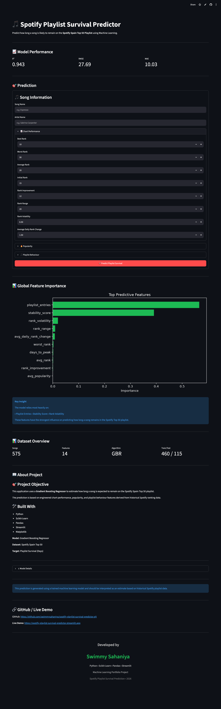

# 🎵 Spotify Playlist Survival Predictor

A Machine Learning web application that predicts **how long a song is likely to remain on the Spotify Spain Top 50 playlist** based on historical chart performance, popularity metrics, and playlist behaviour.

Built using **Python, Scikit-Learn, Streamlit, and Gradient Boosting Regressor**, this project demonstrates an end-to-end machine learning workflow—from data preprocessing and feature engineering to model deployment.

---

## 🚀 Live Demo

**[Streamlit App](https://spotify-playlist-survival-predictor.streamlit.app)**

---

## 📌 Project Overview

Streaming platforms constantly introduce new songs, but only a few remain popular for long periods.

This project predicts the expected playlist survival (in days) of a song using historical Spotify ranking data.

The application helps estimate:

- Playlist longevity
- Song stability
- Chart performance
- Popularity trends
- Playlist behaviour

---

# 🎯 Problem Statement

Can historical Spotify ranking patterns predict how long a song will stay on the Spotify Spain Top 50 playlist?

This project answers that question by training multiple regression models and selecting the best-performing model through hyperparameter tuning.

---

# 📊 Dataset Overview

Dataset: Spotify Spain Top 50 Playlist Dataset

Target Variable: Playlist Survival (Days)

Total Songs: **575**

Features: **14**

Examples of features:

- Best Rank
- Worst Rank
- Average Rank
- Initial Rank
- Rank Improvement
- Rank Range
- Rank Volatility
- Average Daily Rank Change
- Peak Popularity
- Average Popularity
- Popularity Gap
- Playlist Entries
- Days to Peak
- Stability Score

---

# ⚙️ Machine Learning Pipeline

The project follows a complete ML workflow.

```
Raw Dataset
      │
      ▼
Data Cleaning
      │
      ▼
Feature Engineering
      │
      ▼
Train-Test Split
      │
      ▼
Model Training
      │
      ▼
Hyperparameter Tuning
      │
      ▼
Model Evaluation
      │
      ▼
Model Deployment
```

---

# 🧠 Models Evaluated

The following regression models were trained and compared.

- Linear Regression
- Decision Tree Regressor
- Random Forest Regressor
- Gradient Boosting Regressor

After evaluation, **Gradient Boosting Regressor** achieved the best performance.

---

# 🏆 Final Model

Algorithm

Gradient Boosting Regressor

Best Parameters

```
n_estimators = 300
learning_rate = 0.1
max_depth = 2
subsample = 1.0
```

---

# 📈 Model Performance

| Metric | Score |
|---------|--------|
| R² Score | **0.943** |
| RMSE | **27.69** |
| MAE | **10.03** |

The model explains approximately **94% of the variance** in playlist survival, indicating excellent predictive performance.

---

# 📊 Feature Importance

The model identifies the following as the most influential features.

1. Playlist Entries
2. Stability Score
3. Rank Volatility
4. Rank Range
5. Average Daily Rank Change

These features contribute the most toward predicting playlist survival.

---

# 💻 Streamlit Application

The deployed web application allows users to:

✅ Enter song information

✅ Adjust chart performance metrics

✅ Configure popularity features

✅ Specify playlist behaviour

✅ Predict playlist survival instantly

The application also provides:

- Prediction Confidence
- Playlist Longevity Indicator
- Feature Importance Chart
- Model Performance Metrics
- Prediction Summary
- Dataset Overview
- Project Information

---

# 📷 Application Preview

## Home Page



---

# 📁 Project Structure

```
spotify-playlist-survival-predictor/

├── dashboard/
│   ├── app.py

├── data/
│   ├── atlantic_spain.csv
│   ├── atlantic_spain_cleaned.csv
│   ├── demo_predictions.csv
│   ├── feature_importance.csv
│   ├── final_model_metrics.csv
│   ├── lifecycle_advanced_features.csv
│   ├── lifecycle_features.csv
│   ├── model_comparison.csv
│   ├── model_predictions.csv
│   ├── X_train.csv
│   ├── X_test.csv
│   ├── y_train.csv
│   └── y_test.csv
│

├── images/
│   └── dashboard.png
│

├── models/
│   └── final_gradient_boosting.pkl
│

├── notebooks/
│   ├── 01_data_loading.ipynb
│   ├── 02_data_cleaning.ipynb
│   ├── 03_feature_engineering.ipynb
│   ├── 04_exploratory_data_analysis.ipynb
│   ├── 05_model_training.ipynb
│   ├── 06_model_comparison.ipynb
│   ├── 07_model_tuning.ipynb
│   ├── 08_feature_importance.ipynb
│   ├── 09_model_evaluation.ipynb
│   ├── 10_deployment.ipynb
│

├── .gitignore

├── README.md

├── requirements.txt
```

---

# 🛠 Technologies Used

- Python
- Pandas
- NumPy
- Matplotlib
- Scikit-Learn
- Joblib
- Streamlit
- Jupyter Notebook

---

# ▶️ Installation

Clone the repository

```bash
git clone https://github.com/swimmysahaniya/spotify-playlist-survival-predictor.git
```

Move into the project directory

```bash
cd spotify-playlist-survival-predictor
```

Install dependencies

```bash
pip install -r requirements.txt
```

Run the application

```bash
streamlit run dashboard/app.py
```

---

# 📖 Business Value

The model can help:

- Music Analysts
- Record Labels
- Artists
- Playlist Curators
- Marketing Teams

estimate a song's expected playlist lifespan and understand which characteristics contribute most to long-term playlist success.

---

# 🔮 Future Improvements

- Spotify API Integration
- Automatic Song Search
- SHAP Explainability
- XGBoost & LightGBM Comparison
- Deep Learning Model
- Real-time Playlist Prediction
- Docker Deployment
- Cloud Deployment on AWS

---

# 🎥 Project Demo

Watch the complete walkthrough of the project, including:

- 📊 Data Cleaning
- ⚙️ Feature Engineering
- 🤖 Machine Learning Model Training
- 📈 Model Evaluation
- 🎯 Streamlit Application
- 📋 Prediction Summary
- 🚀 Live Demo

▶️ **[Watch the Project Demo](https://youtu.be/JghDE4B7uZA)**

---

# 👨‍💻 Author

## Swimmy Sahaniya

Machine Learning Engineer

### Skills

- Python
- Machine Learning
- Scikit-Learn
- Streamlit
- SQL
- Pandas
- Data Visualization

---

# ⭐ If you found this project useful...

Please consider giving it a ⭐ on GitHub!

---